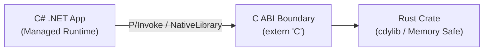

# Rust for C# Developers 🦀 ⇄ 🟣

[](https://awesome.re)
[](https://opensource.org/licenses/MIT)
[](https://www.rust-lang.org/)
[](https://dotnet.microsoft.com/)
[](CONTRIBUTING.md)

> [!IMPORTANT]
> ### 🤖 AI-Generated Guide Disclosure
> **This guide is entirely AI-generated.** While compiled and structured against modern .NET and Rust practices, code snippets, conceptual mappings, or external links may contain inaccuracies or drift over time.
>
> **Community contributions are welcome!** Please feel free to [open an issue](https://github.com/ryanrodemoyer/rust-for-csharp-developers/issues) for fixes, updates, and enhancements, or submit a [Pull Request](CONTRIBUTING.md).

> **The definitive Rosetta Stone, architectural guide, and curated resource hub for C# and .NET engineers mastering Rust.**

Whether you are looking to eliminate garbage collection pauses, write ultra-fast systems infrastructure, compile to WebAssembly, or interop native Rust code with existing .NET applications, this guide and directory bridges the conceptual gap between the .NET and Rust ecosystems.

---

## 📑 Table of Contents

1. [The State of Rust for .NET Developers (Landscape Analysis)](#-the-state-of-rust-for-net-developers-landscape-analysis)
2. [C# ⇄ Rust Rosetta Stone (Quick Comparison)](#-c--rust-rosetta-stone)
   - [Core Concepts & Mental Models](#core-concepts--mental-models)
   - [CLI & Tooling](#cli--tooling)
   - [Common Types & Collections](#common-types--collections)
   - [LINQ vs. Iterator Adapters](#linq-vs-iterator-adapters)
   - [Ecosystem & Popular Crates vs. NuGet Packages](#ecosystem--popular-crates-vs-nuget-packages)
3. [Recommended VS Code Setup (For Visual Studio / C# Devs)](#-recommended-vs-code-setup-for-visual-studio--c-devs)
4. [Curated Existing Resources](#-curated-existing-resources)
   - [GitHub Repositories](#github-repositories)
   - [Deep-Dive Articles & Blog Series](#deep-dive-articles--blog-series)
   - [Conference Talks & Videos](#conference-talks--videos)
   - [Cheat Sheets & Quick References](#cheat-sheets--quick-references)
   - [Foundational Rust Material](#foundational-rust-material)
5. [C# and Rust Interoperability (FFI)](#-c-and-rust-interoperability-ffi)
   - [Top Interop Libraries](#top-interop-libraries)
   - [Architectural Patterns](#architectural-patterns)
6. [The 5 Critical Mental Model Shifts](#-the-5-critical-mental-model-shifts)
7. [Side-by-Side Code Walkthroughs](#-side-by-side-code-walkthroughs)
8. [Contributing](#-contributing)
9. [License](#-license)

---

## 🔍 The State of Rust for .NET Developers (Landscape Analysis)

As Microsoft expands internal Rust adoption across the Windows kernel, Azure hypervisor services, and GitHub Copilot infrastructure, an increasing number of C#/.NET developers are exploring Rust. However, the current educational landscape has historically suffered from significant gaps:

| Resource | Status | Strengths | Limitations / Gaps |
| :--- | :--- | :--- | :--- |
| **`microsoft/rust-for-dotnet-devs`** | Inactive (~3 yrs) | Official Microsoft naming, clear introductions to basic scalar and custom types | Incomplete. Abandoned before reaching Ownership, Lifetimes, Async, Iterators/LINQ, Error Handling, or Cargo. |
| **`codefinity/c-sharp-to-rust-learning`** | Active (2024 Edition) | Runnable Cargo workspace with 22 structured modules, CLI and Axum examples | Codebase-heavy; focused on running individual binaries rather than a comprehensive, scannable conceptual reference. |
| **`microsoft/RustTraining`** | Active | Structured corporate enterprise modules including a C# bridge chapter | High-level presentation slide format; lacks community-driven depth and interop walkthroughs. |
| **Community Blog Posts & Gists** | Scattered | Relatable first-person perspectives (e.g., Chris Woodruff's "42 Days of Rust") | Fragmented across personal blogs, Medium paywalls, and Reddit threads; often outdated or missing modern Rust idioms. |

**The Goal of this Repository:** To serve as the single, authoritative, up-to-date community hub and Rosetta Stone that aggregates every valuable resource while providing direct, side-by-side answers to every question a .NET developer faces when learning Rust.

---

## 🔄 C# ⇄ Rust Rosetta Stone

### Core Concepts & Mental Models

| C# Concept (.NET) | Rust Equivalent | Architectural Notes |
| :--- | :--- | :--- |
| **Garbage Collector (GC)** | **Ownership, Borrowing & RAII** | Rust tracks ownership at compile time. Memory is freed deterministically when variables drop out of scope. |
| **Class (`class`)** | **`struct` + `impl` block** | Rust cleanly separates data definition (`struct`) from behavior (`impl`). There are no class hierarchies. |
| **Interface (`interface`)** | **Trait (`trait`)** | Traits define behavior contracts. They can be implemented for any type (even types from external libraries). |
| **Inheritance (`class B : A`)** | **Composition & Traits (`impl Trait for Struct`)** | Rust has no class inheritance. Reuse logic via trait default implementations or struct wrapping. |
| **`null` / `Nullable<T>`** | **`Option<T>` (`Some(T)` or `None`)** | Rust has no `null` pointers in safe code. The compiler forces explicit handling of absence. |
| **Exceptions (`try / catch / throw`)** | **`Result<T, E>` & `?` operator** | Recoverable errors are explicit return values. Panics (`panic!`) are reserved for unrecoverable bugs. |
| **`IDisposable` & `using`** | **`Drop` trait (Automatic RAII)** | Destruction happens automatically at the end of the enclosing block scope—no explicit `using` needed. |
| **Generics (`where T : IFoo`)** | **Generics & Trait Bounds (`fn foo<T: Trait>()`)** | Monomorphized at compile time with zero runtime dispatch cost by default. |
| **Virtual Dispatch (`virtual` / `override`)** | **Trait Objects (`&dyn Trait` / `Box<dyn Trait>`)** | Dynamic dispatch via vtables is opt-in using the `dyn` keyword. |
| **Reflection / Attributes (`[Attribute]`)** | **Procedural & Derive Macros (`#[derive(...)]`)** | Rust code generation occurs at compile time; there is no runtime reflection overhead. |
| **`Task<T>` & `async` / `await`** | **`Future<Output=T>` & `tokio` / `async` / `.await`** | C# tasks are "hot" (eager background execution). Rust futures are "cold" (idle until polled by an executor). |
| **Thread Pool (`ThreadPool.QueueUserWorkItem`)** | **`rayon` (Data parallelism) / `tokio` (Async I/O)** | Threading is decoupled from the language runtime and provided by specialized crates. |

---

### CLI & Tooling

| C# / .NET CLI | Rust Cargo Command | Description |
| :--- | :--- | :--- |
| `dotnet new console -n MyApp` | `cargo new my_app --bin` | Create a new executable project |
| `dotnet new classlib -n MyLib` | `cargo new my_lib --lib` | Create a new library package |
| `dotnet build` | `cargo build` | Compile the project (debug mode) |
| `dotnet build -c Release` | `cargo build --release` | Compile with optimizations enabled |
| `dotnet run` | `cargo run` | Compile and execute binary target |
| `dotnet test` | `cargo test` | Run unit, integration, and doc tests |
| `dotnet pack` | `cargo package` | Pack crate for distribution |
| `dotnet add package <Package>` | `cargo add <crate>` | Add dependency to `Cargo.toml` |
| `dotnet restore` | `cargo fetch` / `cargo check` | Download and cache dependencies |
| `dotnet format` | `cargo fmt` | Format source code according to style rules |
| `dotnet build --no-incremental /warnaserror` | `cargo clippy` | Run linter for code smells and idiomatic improvements |
| `global.json` / SDK installation | `rustup` (`rust-toolchain.toml`) | Manage compiler toolchains and target architectures |
| `nuget.org` | `crates.io` | Central package registry |
| `.sln` (Solution) | Cargo Workspace (`[workspace]` in `Cargo.toml`) | Multi-project repository structure |
| `.csproj` | `Cargo.toml` | Project manifest and dependency declarations |

---

### Common Types & Collections

| .NET / C# Type | Rust Equivalent | Notes |
| :--- | :--- | :--- |
| `string` | `&str` (borrowed slice) / `String` (heap-allocated) | Rust distinguishes between immutable string views (`&str`) and growable buffers (`String`). |
| `ReadOnlySpan<char>` | `&str` | Direct borrowed memory view over valid UTF-8 characters. |
| `byte[]` | `Vec<u8>` or `&[u8]` | Contiguous growable heap buffer vs borrowed byte slice. |
| `List<T>` | `Vec<T>` | Dynamically sized, contiguous heap array. |
| `Dictionary<TKey, TValue>` | `std::collections::HashMap<K, V>` | Key-value hash table. |
| `SortedDictionary<K, V>` | `std::collections::BTreeMap<K, V>` | Ordered key-value tree based on B-Trees. |
| `HashSet<T>` | `std::collections::HashSet<T>` | Unique elements set. |
| `Queue<T>` / `LinkedList<T>` | `std::collections::VecDeque<T>` | Double-ended queue implemented with a ring buffer. |
| `Tuple<T1, T2>` / `(T1, T2)` | `(T1, T2)` | First-class tuples. |
| `object` | `Box<dyn Any>` | Rare in Rust; dynamic typing is intentionally discouraged. |
| `record` | `#[derive(PartialEq, Eq, Debug, Clone)] struct` | Data-first immutable/value-like records. |
| `enum` | Algebraic Data Types (`enum`) | Rust enums can hold associated payloads (tagged unions / sum types). |

---

### LINQ vs. Iterator Adapters

In C#, LINQ operates over `IEnumerable<T>`. In Rust, you call `.iter()`, `.iter_mut()`, or `.into_iter()` to create a zero-cost iterator chain, then conclude with `.collect()` or a consumer:

| C# LINQ Method | Rust Iterator Adapter | Notes |
| :--- | :--- | :--- |
| `.Select(x => x * 2)` | `.map(\|x\| x * 2)` | Transforms each element |
| `.Where(x => x > 5)` | `.filter(\|x\| *x > 5)` | Filters elements matching predicate |
| `.SelectMany(x => x.SubItems)` | `.flat_map(\|x\| x.sub_items)` | Flattens nested sequences |
| `.Take(n)` | `.take(n)` | Yields first `n` elements |
| `.Skip(n)` | `.skip(n)` | Skips first `n` elements |
| `.First()` / `.FirstOrDefault()` | `.next()` / `.find(\|x\| ...)` | Retrieves first item or `None` |
| `.Any(predicate)` | `.any(\|x\| ...)` | Returns boolean if any item satisfies condition |
| `.All(predicate)` | `.all(\|x\| ...)` | Returns boolean if all items satisfy condition |
| `.Count()` | `.count()` | Consumes iterator and counts items |
| `.OrderBy(x => x.Prop)` | `.collect::<Vec<_>>()`, then `.sort_by(...)` | Sorting typically requires a collected vector |
| `.Aggregate(seed, (acc, x) => ...)` | `.fold(seed, \|acc, x\| ...)` | Reduces sequence to single value |
| `.ToList()` / `.ToArray()` | `.collect::<Vec<_>>()` | Collects iterator into collection |
| `.Distinct()` | `.collect::<HashSet<_>>()` or itertools `.unique()` | Deduplicates items |
| `.Zip(other)` | `.zip(other)` | Combines two iterators element-wise |

---

### Ecosystem & Popular Crates vs. NuGet Packages

| .NET / C# Ecosystem | Rust Crates Ecosystem | Description |
| :--- | :--- | :--- |
| **ASP.NET Core Minimal APIs / MVC** | `axum`, `actix-web` | High-performance HTTP server frameworks |
| **Entity Framework Core / Dapper** | `sqlx` (compile-time checked SQL), `diesel` (ORM) | Database querying and mapping |
| **Newtonsoft.Json / System.Text.Json** | `serde` & `serde_json` | Industry-standard serialization framework |
| **Serilog / NLog / ILogger** | `tracing` & `tracing-subscriber` | Structured logging and asynchronous diagnostics |
| **CommandLineParser / System.CommandLine** | `clap` | Declarative command line argument parsing |
| **Polly (Resilience & Retry)** | `backon`, `tower` | Middleware, retry policies, circuit breakers |
| **BenchmarkDotNet** | `criterion`, `divan` | Statistically rigorous micro-benchmarking |
| **xUnit / NUnit** | Built-in `#[test]`, `proptest`, `rstest` | Testing suites and property-based testing |
| **MediatR** | Message-passing with `tokio::sync::mpsc` or `flume` | In-process decoupling and event publishing |
| **FluentValidation** | `validator`, `garde` | Validation attributes and custom logic |
| **AutoMapper** | Idiomatic `From<T>` and `Into<T>` trait implementations | Explicit, zero-cost type conversions |

---

## 🛠️ Recommended VS Code Setup (For Visual Studio / C# Devs)

Coming from Visual Studio or the C# Dev Kit, you are accustomed to rich IntelliSense, immediate compiler diagnostics, effortless NuGet management, and intuitive step-through debugging. You do not need a bloated extension pack to get this in Rust. The following curated setup gives you an equivalent full-IDE experience in VS Code.

This repository includes a pre-configured [`.vscode/extensions.json`](.vscode/extensions.json) and [`.vscode/settings.json`](.vscode/settings.json).

### The Essential Extension Stack

| Extension | VS Code ID | What It Replaces From the .NET / Visual Studio World |
| :--- | :--- | :--- |
| **[rust-analyzer](https://marketplace.visualstudio.com/items?itemName=rust-lang.rust-analyzer)** | `rust-lang.rust-analyzer` | **Roslyn / OmniSharp / C# Dev Kit.** The official language server. Provides smart completion, go-to-definition, type inference hints, parameter hints, and code actions. *(Note: Avoid the deprecated legacy "Rust" extension).* |
| **[CodeLLDB](https://marketplace.visualstudio.com/items?itemName=vadimcn.vscode-lldb)** | `vadimcn.vscode-lldb` | **CoreCLR / vsdbg Debugger.** Native debugger integration. Set breakpoints, step through code, inspect registers, memory, and variables. |
| **[Even Better TOML](https://marketplace.visualstudio.com/items?itemName=tamasfe.even-better-toml)** | `tamasfe.even-better-toml` | **`.csproj` / XML Schema Validation.** Gives full syntax highlighting, schema validation, and autocompletion for `Cargo.toml`. |
| **[Dependi](https://marketplace.visualstudio.com/items?itemName=fill-labs.dependi)** | `fill-labs.dependi` | **NuGet Package Manager GUI.** Displays the latest crate versions, outdated dependencies, and feature flags directly inside `Cargo.toml`. |
| **[Error Lens](https://marketplace.visualstudio.com/items?itemName=usernamehw.errorlens)** | `usernamehw.errorlens` | **Visual Studio Error List & In-Editor Squiggles.** Highlights compiler and borrow-checker diagnostics inline directly on the line of code. Essential for learning Rust because the compiler's feedback is famously thorough. |

### Recommended `settings.json`

Add these settings to your workspace (`.vscode/settings.json`) for automatic formatting and Roslyn-like background analysis with Clippy:

```json
{
  "[rust]": {
    "editor.defaultFormatter": "rust-lang.rust-analyzer",
    "editor.formatOnSave": true
  },
  "rust-analyzer.check.command": "clippy",
  "rust-analyzer.inlayHints.typeHints.enable": true,
  "rust-analyzer.inlayHints.parameterHints.enable": true,
  "rust-analyzer.inlayHints.chainingHints.enable": true
}
```

> **Tip for C# Devs:** Setting `"rust-analyzer.check.command": "clippy"` makes `rust-analyzer` run Rust's linter (Clippy) on save, functioning just like Roslyn analyzers in Visual Studio to teach you idiomatic Rust patterns in real time.

---

## 📚 Curated Existing Resources

### GitHub Repositories

* **[microsoft/rust-for-dotnet-devs](https://github.com/microsoft/rust-for-dotnet-devs)**
  * *Description:* Microsoft's community guide introducing C#/.NET developers to basic Rust concepts (scalar types, strings, structs, enums).
  * *Notes:* Inactive since 2021/2022, but useful for fundamental syntax alignment.
* **[codefinity/c-sharp-to-rust-learning](https://github.com/codefinity/c-sharp-to-rust-learning)**
  * *Description:* An extensive, runnable 22-module Cargo workspace built with Rust 1.95 (Edition 2024).
  * *Highlights:* Features side-by-side examples covering ownership, lifetimes, Tokio async, LINQ vs iterators, Axum web APIs, and benchmarks.
* **[microsoft/RustTraining](https://github.com/microsoft/RustTraining)**
  * *Description:* Official Microsoft training materials, including the specific module *"Rust for C# Programmers"*.
  * *Highlights:* High-level overview designed for enterprise engineering teams.
* **[PsichiX/rust-concepts-for-csharp](https://github.com/PsichiX/rust-concepts-for-csharp)**
  * *Description:* Explores memory management, safety, and systems programming paradigms from a C# developer's perspective.
* **[Cysharp/csbindgen](https://github.com/Cysharp/csbindgen)**
  * *Description:* Production-grade FFI generator created by Yoshifumi Kawai for generating C# bindings directly from Rust code.

---

### Deep-Dive Articles & Blog Series

* **[42 Days of Rust for C# Developers](https://woodruff.dev/category/rust/) — Chris Woodruff**
  * An extensive, candid multi-part blog series documenting the day-by-day mindset shift from .NET to Rust, grappling with the borrow checker, and unlearning garbage collector dependencies.
* **[Rust Guide for C#/.NET Engineers: A Deep Dive](https://zeeshanadil.com/rust-guide-for-cs-dotnet-engineers-a-deep-dive) — Zeeshan Adil**
  * A comprehensive breakdown examining memory layouts, error handling via `Result`, and module hierarchy differences.
* **[The Complete OOP to Rust Learning Path](https://medium.com/@enzolombardi) — Enzo Lombardi**
  * An insightful guide mapping object-oriented design patterns, polymorphism, and dependency injection into Rust traits and composition.
* **[What Switching From C# to Rust Actually Taught Me](https://dev.to)**
  * Practical retrospective on how learning Rust's strict ownership model fundamentally improves the way you write C# and manage allocations.
* **[Calling Rust from C# via DllImport](https://dev.to)**
  * Step-by-step tutorial on compiling a Rust `cdylib` and consuming it directly from .NET 6/7/8/9.

---

### Conference Talks & Videos

* **["C# and Rust: Combining Managed and Unmanaged Code Without Sacrificing Safety"](https://www.youtube.com/watch?v=...) — Ashley Mannix (NDC)**
  * The definitive conference talk detailing how to bridge .NET applications with native Rust libraries safely and efficiently.
* **["Microsoft Is Abandoning C# for Rust! Now What?"](https://www.youtube.com/watch?v=...) — Nick Chapsas**
  * Pragmatic breakdown of why Microsoft is using Rust for security-critical systems (Windows kernel, Azure infrastructure) and what it means for C# engineers.
* **[Microsoft Beginner's Series to Rust](https://aka.ms/GetStartedWithRust)**
  * Video training path by Microsoft engineers for experienced developers adopting Rust.

---

### Cheat Sheets & Quick References

* **[iArmanKarimi C# to Rust Cheat Sheet (Gist)](https://gist.github.com/iArmanKarimi/913b869279a04a6279f18b6e68652431)**
  * Scannable cheatsheet mapping C# keywords, types, and operations directly to Rust.
* **[HIMISOCOOL C# to Rust Comparative Gist](https://gist.github.com/HIMISOCOOL/fe02fc1030fbc55f0d07376faba12d6d)**
  * Side-by-side syntax cheatsheet covering basic control flow and structures.

---

### Foundational Rust Material

When moving past basic comparisons, every C# developer should consult these standard Rust texts:

* **[The Rust Programming Language ("The Book")](https://doc.rust-lang.org/book/)** — The official bible for learning Rust from first principles.
* **[Rustlings](https://github.com/rust-lang/rustlings)** — Small, hands-on compiler exercises that build muscle memory for Rust syntax and errors.
* **[Rust by Example](https://doc.rust-lang.org/rust-by-example/)** — Code-driven reference for idiomatic syntax.
* **[Comprehensive Rust (Google)](https://google.github.io/comprehensive-rust/)** — Fast-paced 4-day Rust course developed by the Android team at Google.

---

## 🔗 C# and Rust Interoperability (FFI)

You do not need to rewrite your entire .NET stack to benefit from Rust. You can write performance-critical or security-sensitive modules in Rust and invoke them natively from C#.



### Top Interop Libraries

1. **[csbindgen](https://github.com/Cysharp/csbindgen)** *(Recommended for simplicity)*
   - Automates generation of C# `DllImport` / `LibraryImport` wrapper classes directly from Rust `extern "C"` functions.
   - Zero external runtime dependencies; supports NativeAOT, Unity, and standard .NET 8+.
2. **[interoptopus](https://github.com/ralfbiedert/interoptopus)** *(Recommended for complex APIs)*
   - Advanced multi-language FFI framework with first-class C# support.
   - Automatically handles composite structs, enums, fat pointers, and callbacks with zero-copy overhead.
3. **[uniffi-bindgen-cs](https://github.com/NordSecurity/uniffi-bindgen-cs)**
   - C# target for Mozilla's UniFFI generator, enabling multi-language bindings (C#, Swift, Kotlin, Python) from a single UDL specification.
4. **[BoltFFI](https://github.com/bolt-ffi)**
   - High-performance, modern FFI tooling that compiles native binaries and packages them directly into ready-to-consume `.nupkg` packages.

---

## 🧠 The 5 Critical Mental Model Shifts

### 1. Memory: Garbage Collection vs. Ownership & Borrowing
* **In C#:** The Garbage Collector periodically pauses and cleans up unreferenced objects on the managed heap. Variables are references by default (`class`), and you rarely worry about lifespans unless handling unmanaged handles (`IDisposable`).
* **In Rust:** Every value has exactly one owner at any time. When the owner goes out of scope, the memory is released immediately. You can borrow data immutably (`&T`) as many times as you like, or mutably (`&mut T`) exactly once.

### 2. Composition Over Inheritance
* **In C#:** You design around class hierarchies (`abstract class Animal`, `class Dog : Animal`), overrides, and virtual dispatch.
* **In Rust:** There is no `class` and no inheritance. You model data using pure `struct`s and shared capabilities using `trait`s. Shared implementation is achieved through trait defaults or composition (containing another struct).

### 3. Error Handling: Exceptions vs. Monads
* **In C#:** Exceptional situations throw exceptions (`throw new InvalidOperationException()`), which unwind the stack up to the nearest `try/catch`. Methods do not declare what exceptions they may throw.
* **In Rust:** Errors are values. A method that can fail must return `Result<T, E>`. The caller must explicitly handle both branches or propagate the error up the call chain with the `?` operator.

### 4. Asynchronous Execution: Eager vs. Lazy
* **In C#:** A `Task` starts executing immediately upon creation in the thread pool.
* **In Rust:** A `Future` does nothing until it is explicitly `.await`ed or spawned onto an asynchronous runtime like `tokio`. Rust futures are state machines driven by polling.

### 5. Absoluteness of Null
* **In C#:** Even with Nullable Reference Types (`string?`), `null` can still exist at runtime, leading to `NullReferenceException`.
* **In Rust:** `null` does not exist in safe Rust. If a value might be missing, it is encapsulated in an `Option<T>` (`Some(val)` or `None`).

---

## 💻 Side-by-Side Code Walkthroughs

### 1. Modeling Data & Behavior

#### C#
```csharp
public interface IGreeter
{
    string Greet();
}

public record User(string Name, int Age) : IGreeter
{
    public string Greet() => $"Hello, my name is {Name} and I am {Age} years old.";
}
```

#### Rust
```rust
pub trait Greeter {
    fn greet(&self) -> String;
}

pub struct User {
    pub name: String,
    pub age: u32,
}

impl Greeter for User {
    fn greet(&self) -> String {
        format!("Hello, my name is {} and I am {} years old.", self.name, self.age)
    }
}
```

---

### 2. Error Handling (Exceptions vs. Result)

#### C#
```csharp
public int ParseAndDivide(string input, int divisor)
{
    if (divisor == 0)
        throw new DivideByZeroException("Divisor cannot be zero.");

    int value = int.Parse(input); // Can throw FormatException
    return value / divisor;
}
```

#### Rust
```rust
use std::num::ParseIntError;

#[derive(Debug)]
pub enum MathError {
    Parse(ParseIntError),
    DivideByZero,
}

pub fn parse_and_divide(input: &str, divisor: i32) -> Result<i32, MathError> {
    if divisor == 0 {
        return Err(MathError::DivideByZero);
    }
    
    let value: i32 = input.parse().map_err(MathError::Parse)?;
    Ok(value / divisor)
}
```

---

### 3. LINQ vs. Rust Iterators

#### C#
```csharp
var numbers = new List<int> { 1, 2, 3, 4, 5, 6, 7, 8, 9, 10 };

var result = numbers
    .Where(n => n % 2 == 0)
    .Select(n => n * 10)
    .Take(3)
    .ToList();
// Output: [20, 40, 60]
```

#### Rust
```rust
let numbers = vec![1, 2, 3, 4, 5, 6, 7, 8, 9, 10];

let result: Vec<i32> = numbers
    .into_iter()
    .filter(|n| n % 2 == 0)
    .map(|n| n * 10)
    .take(3)
    .collect();
// Output: [20, 40, 60]
```

---

## 🤝 Contributing

Contributions are eagerly welcome! Have you published a blog post, written an open-source bridge tool, or created a helpful video tutorial for .NET developers learning Rust?

1. Fork this repository.
2. Add your resource to the relevant section in `README.md`.
3. Ensure links are working and include a concise description of why it helps C# developers.
4. Submit a Pull Request!

See [CONTRIBUTING.md](CONTRIBUTING.md) for full contribution guidelines.

---

## 📄 License

This project is licensed under the [MIT License](LICENSE).
